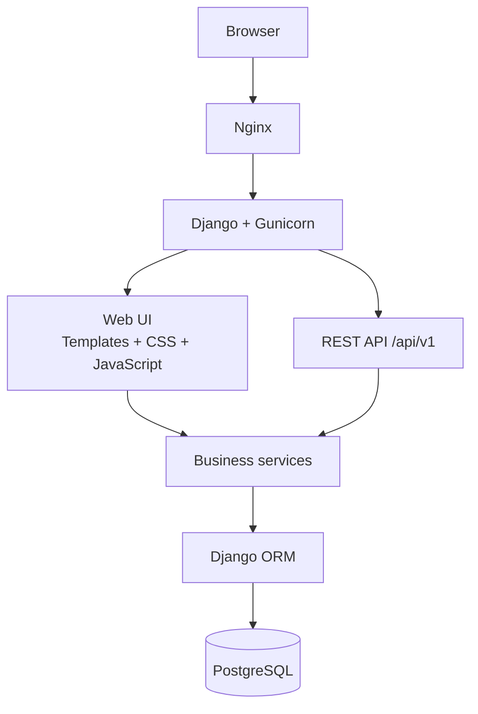

# LEF Timesheet

Applicazione web per la gestione dei timesheet dei consulenti esterni LEF.

Il repository contiene l'applicazione Django completa, l'API REST, il frontend server-rendered, la configurazione Docker/PostgreSQL/Nginx, gli script operativi e la documentazione tecnica.

## Funzionalità principali

- autenticazione con email e gestione dei ruoli;
- anagrafiche consulenti e clienti;
- commesse, assegnazioni e ruolo Project Manager per singola commessa;
- tariffe storicizzate per assegnazione e tipo di attività;
- inserimento e modifica di ore e spese;
- limite giornaliero di 8 ore per il consulente;
- blocco delle righe corrette da Admin LEF;
- chiusura e riapertura dei periodi mensili;
- dashboard Admin, Project Manager e Consulente;
- report mensile ed esportazione Excel;
- promemoria automatici;
- importazioni massive con anteprima/errori;
- audit delle operazioni amministrative;
- API REST versionata `/api/v1/` con token, rate limiting e documentazione OpenAPI;
- health/readiness check, backup/restore, staging e configurazione production.

## Architettura



Il Project Manager non è un ruolo globale dell'utente: è una qualifica dell'assegnazione consulente/commessa. Questa scelta impedisce di estendere la visibilità PM a progetti sui quali l'utente non ha tale responsabilità.

## Moduli applicativi

| Modulo | Responsabilità |
|---|---|
| `apps/accounts` | utenti, autenticazione e account consulenti |
| `apps/projects` | clienti, commesse, assegnazioni e tariffe |
| `apps/timesheets` | ore e spese di trasferta |
| `apps/operations` | periodi, dashboard, report, promemoria, import e audit |
| `apps/api` | interfaccia REST, token, permessi e sicurezza API |
| `apps/common` | modelli astratti, mixin e viste condivise |

## Stack

- Python 3.13
- Django 5.2
- Django REST Framework
- PostgreSQL 18
- Gunicorn
- Nginx
- Docker Compose
- HTML / CSS / JavaScript nativo

## Avvio sviluppo

```powershell
Copy-Item .env.example .env
docker compose up -d --build
docker compose exec -T web python manage.py migrate
docker compose exec -T web python manage.py createsuperuser
```

Applicazione: `http://localhost:8000/`

Health check: `http://localhost:8000/health/`

## Production locale

```powershell
Copy-Item .env.production.example .env.production
```

Compilare i valori reali, quindi:

```powershell
.\scripts\production\preflight_production.ps1
docker compose --env-file .env.production -f docker-compose.prod.yml up -d --build
```

## Backup completo

Il dump PostgreSQL non contiene i documenti caricati. Per un backup ripristinabile usare lo script completo, che salva **database + `private_media` + `media`** nello stesso bundle:

```powershell
.\scripts\backup\backup_nokihub.ps1 -ComposeFile docker-compose.prod.yml
```

Ripristino (operazione distruttiva):

```powershell
.\scripts\restore\restore_nokihub.ps1 `
  -BackupDirectory .\backups\nokihub_YYYYMMDD_HHMMSS `
  -ComposeFile docker-compose.prod.yml `
  -ConfirmRestore
```

Il vecchio `backup_postgres.ps1` resta disponibile per dump **solo database**, ma non è sufficiente come disaster-recovery backup dell'applicazione.

## Sicurezza upload e proxy

- i documenti riservati sono conservati in `private_media` e non vengono serviti direttamente da Nginx;
- i documenti sono validati per estensione, dimensione e firma/formato del contenuto;
- il limite applicativo documenti è 10 MB e Nginx accetta richieste fino a 12 MB per includere l'overhead multipart;
- il login web applica rate limiting configurabile;
- quando `API_TRUST_X_FORWARDED_FOR=True`, configurare `API_NUM_PROXIES` con il numero reale di reverse proxy fidati.

## Test

```powershell
docker compose exec -T web python manage.py check
docker compose exec -T web python manage.py test --verbosity 1
```

La suite è organizzata per area funzionale in `tests/` e non per cronologia di sviluppo.

## Documentazione

- [Architettura](docs/architecture.md)
- [Modello di dominio](docs/domain-model.md)
- [Ruoli e permessi](docs/roles-permissions.md)
- [Regole di business](docs/business-rules.md)
- [API REST](docs/api.md)
- [Deployment](docs/deployment.md)
- [Testing](docs/testing.md)
- [Go-live](docs/go-live.md)
- [Struttura repository](docs/repository-structure.md)

## Dati e segreti

Non versionare mai `.env`, `.env.production`, `.env.staging`, dump PostgreSQL, file di log o contenuti di `media/`. Gli esempi `.env.*.example` contengono esclusivamente placeholder.

## Licenza

Il repository è predisposto per la pubblicazione, ma la licenza deve essere confermata dal titolare dei diritti prima di renderlo pubblico.
